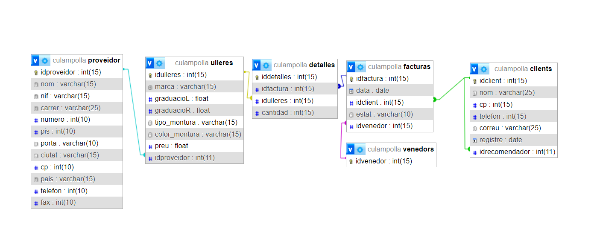

# Ejercicio 1 del nivel 1

## Diagrama 



## [Archivo .sql](./culampolla.sql)
Archivo .sql para la creación de la base de dato y el volcado de datos de prueba 'default'


## Comprobaciones

- Para realizar el listado del total de compras de los clientes, ejecuta la siguiente query:

    ```sql
    SELECT 
        c.idclient, 
        c.nom, 
        SUM(u.preu * d.cantidad) AS total_compres
    FROM 
        clients c
    JOIN 
        facturas f ON c.idclient = f.idclient
    JOIN 
        detalles d ON d.idfactura = f.idfactura
    JOIN 
        ulleres u ON u.idulleres = d.idulleres
    GROUP BY 
        c.idclient, c.nom;
    ```

- Para realizar el listado del total de compras de un cliente en concreto, ejecuta la siguiente query, sustituyendo `<id_client>`, por el id del cliente el qual se quiere obtener su total de compras:

    ```sql
    SELECT 
        c.idclient, 
        c.nom, 
        SUM(u.preu * d.cantidad) AS total_compres
    FROM 
        clients c
    JOIN 
        facturas f ON c.idclient = f.idclient
    JOIN 
        detalles d ON d.idfactura = f.idfactura
    JOIN 
        ulleres u ON u.idulleres = d.idulleres
    WHERE
        c.idclient = <id_client>
    GROUP BY 
        c.idclient, c.nom;
    ```

- Para realizar el listado del total de ventas de un cliente en concreto, ejecuta el siguiente query, sustituyendo `<id_vendedor>`, por el id del vendedor el qual se quiere obtener su total de compras:

    ```sql
    SELECT 
        u.idulleres,
        u.marca,
        d.cantidad 
    FROM 
        facturas f 
    JOIN 
        detalles d ON d.idfactura = f.idfactura 
    JOIN 
        ulleres u ON u.idulleres = d.idulleres 
    WHERE 
        f.idvenedor = <id_vendedor> 
        AND f.data BETWEEN DATE_SUB(CURDATE(), INTERVAL 1 YEAR) AND CURDATE();
    ```

- Para listar los proveedores que sus gafas han sido vendidas, utilizamos el siguiente query:

    ```sql
    SELECT DISTINCT
        p.idproveidor
    FROM
        proveidor p
    JOIN
        ulleres u ON p.idproveidor = u.idproveidor
    JOIN
        detalles d ON u.idulleres = d.idulleres
    JOIN
        facturas f ON d.idfactura = f.idfactura
    ```
