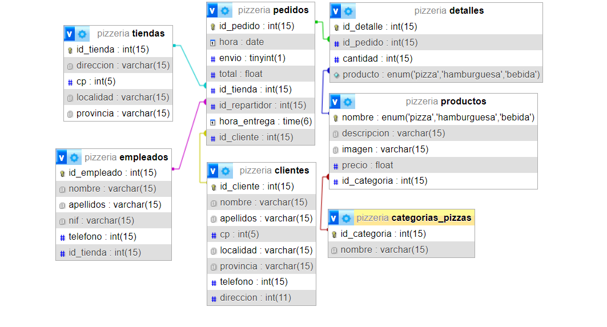

# Ejercicio 2 del nivel 1
## Diagrama


## [Archivo .sql](./pizzeria.sql)
Archivo .sql para la creación de la base de dato y el volcado de datos de prueba 'default'


## Comprobaciones

- Para realizar el listado de cuantos productos de tipo "bebida" se han venido en una localidad en concreto, ejecuta la siguiente query, sustituyendo `<localidad>`, por el id del cliente el qual se quiere obtener su total de compras:

    ```sql
    SELECT t.localidad, COUNT(d.id_detalle) AS total_bebidas_vendidas FROM detalles d 
    JOIN productos p ON d.id_producto = p.id_producto 
    JOIN pedidos o ON d.id_pedido = o.id_pedido 
    JOIN tiendas t ON o.id_tienda = t.id_tienda 
    WHERE p.nombre = 'bebida' AND t.localidad = <localidad> 
    GROUP BY t.localidad;
    ```

    _Para test con el volcado de datos 'default', se puede utilizar 'Barcelona' y 'Madrid' como localidades las cuales deben haber campos._

- Para listar cuantas comandas a realizado un empleado en concreto, ejecuta la siguiente query, sustituyendo `'NOMBRE_EMPLEADO'` y `'APELLIDO_EMPLEADO'`, por el nombre y apellido del empleado a buscar:


    ```sql
    SELECT e.nombre, e.apellidos, COUNT(p.id_pedido) AS total_comandas
    FROM pedidos p
    JOIN empleados e ON p.id_empleado = e.id_empleado
    WHERE e.nombre = 'NOMBRE_EMPLEADO' AND e.apellidos = 'APELLIDOS_EMPLEADO'
    GROUP BY e.nombre, e.apellidos;
    ```

    _Para test con el volcado de datos 'default', se puede utilizar "María Martínez" y "Carlos Gómez" como empleados los cuales deben tener campos._