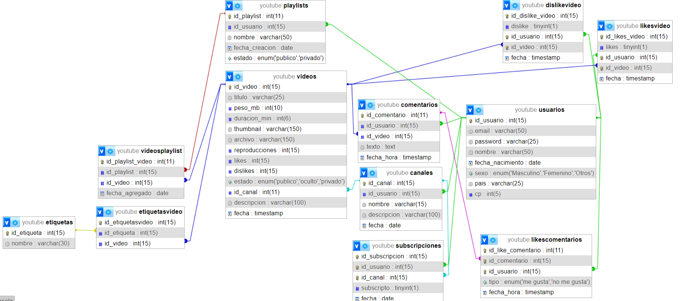

# Ejercicio del nivel 2
## Detalles
- Para actualizar correctamente el contador de `likes` y `dislikes` de la tabla `videos`, utilizamos triggers. Estos se activan al **crear o eliminar** algo de `likevideos` o `dislikevideos`.

    _Por lo tanto: para eliminar `likes` o `dislikes` se eliminara la fila correspondiente en la tabla correspondiente(`likevideos` o `dislikevideos`)_
## Diagrama 

## Archivos sql
### Estructura
- [Base de datos estructura](./youtube-strcture.sql)
### Ejemplo 1
- [Datos base de datos](./youtube-data-1.sql)
- [Base de datos completa](./youtube-complete-1.sql)
- [Querys test base de datos](./youtube-test-1.sql)

