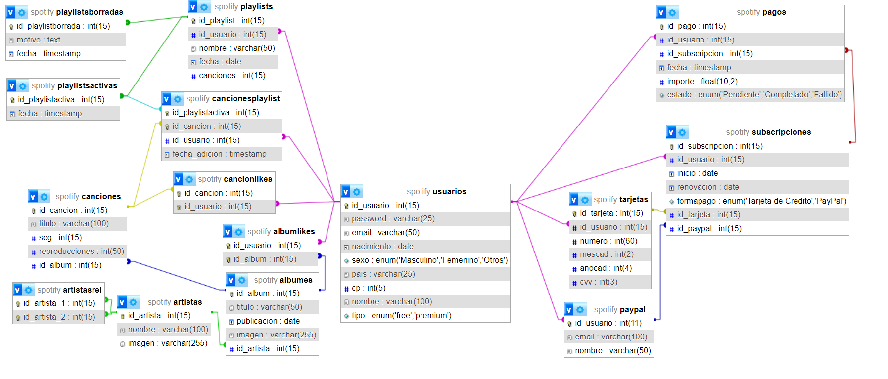

# Ejercicio del nivel 3
## Diagrama

## Archivos sql
### Estructura
- [Base de datos estructura](./spotify-strcture.sql)
### Ejemplo 1
- [Datos base de datos](./spotify-data-1.sql)
- [Base de datos completa](./spotify-complete-1.sql)
#### Querys para test 
##### 1. Usuarios Premium que han realizado su pago

Para encontrar los usuarios premium que han realizado su pago, consideraremos que un pago se ha completado correctamente si el estado del pago es 'Completado'.

```sql
SELECT u.id_usuario, u.nombre, u.email, p.fecha, p.importe
FROM usuarios u
JOIN subscripciones s ON u.id_usuario = s.id_usuario
JOIN pagos p ON s.id_subscripcion = p.id_subscripcion
WHERE u.tipo = 'premium' AND p.estado = 'Completado';
```

Esta consulta une las tablas de `usuarios`, `subscripciones`, y `pagos` para encontrar los usuarios premium cuyos pagos están completados.

##### 2. Usuarios con playlists que incluyen al menos una canción

Para saber qué usuarios tienen playlists activas que contengan al menos una canción:

```sql
SELECT DISTINCT u.id_usuario, u.nombre, pl.nombre AS playlist_nombre
FROM usuarios u
JOIN playlists pl ON u.id_usuario = pl.id_usuario
JOIN cancionesplaylist cp ON pl.id_playlist = cp.id_playlistactiva
WHERE EXISTS (
    SELECT 1 FROM canciones WHERE id_cancion = cp.id_cancion
);
```

Esta consulta identifica a los usuarios y sus playlists que tienen al menos una canción. Usamos `EXISTS` para asegurarnos de que haya al menos una canción en la playlist.

##### 3. Usuarios y su album favorito

Para encontrar la música favorita de cada usuario (tanto canciones como álbumes):

```sql
SELECT u.id_usuario, u.nombre, al.titulo AS album_favorito
FROM usuarios u
LEFT JOIN albumlikes alb ON u.id_usuario = alb.id_usuario
LEFT JOIN albumes al ON alb.id_album = al.id_album;
```

Esta consulta proporciona una vista completa de las preferencias de música de los usuarios, mostrando tanto canciones como álbumes favoritos.

##### 4. Artistas con la mayoría de reproducciones a través de sus canciones

Para encontrar los artistas cuyas canciones han tenido la mayoría de reproducciones:

```sql
SELECT ar.nombre AS artista_nombre, SUM(c.reproducciones) AS total_reproducciones
FROM artistas ar
JOIN albumes al ON ar.id_artista = al.id_artista
JOIN canciones c ON al.id_album = c.id_album
GROUP BY ar.id_artista
ORDER BY total_reproducciones DESC;
```

Esta consulta agrupa por artista y suma las reproducciones de todas sus canciones para ver cuáles son los más populares.

##### 5. Detalle de las subscripciones y métodos de pago de cada usuario

Para ver la información de las subscripciones de cada usuario junto con los métodos de pago utilizados:

```sql
SELECT u.id_usuario, u.nombre, s.inicio, s.renovacion, s.formapago, t.numero AS tarjeta, pp.email AS paypal_email
FROM usuarios u
JOIN subscripciones s ON u.id_usuario = s.id_usuario
LEFT JOIN tarjetas t ON s.id_tarjeta = t.id_tarjeta
LEFT JOIN paypal pp ON s.id_paypal = pp.id_usuario;
```

Esta consulta muestra los detalles de las subscripciones y los métodos de pago asociados, cubriendo tanto tarjetas como cuentas de PayPal.
